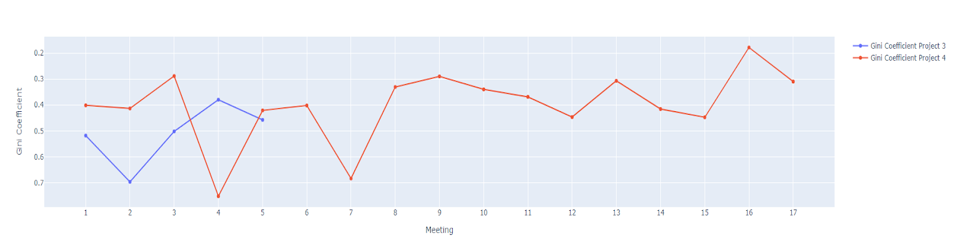

# 📍프로그래머스 4차 프로젝트 

[행동 데이터 기반 협업 모니터링 및 예측 종합 서비스](http://collaboration-analysis-api-env.eba-usqw6syp.ap-northeast-2.elasticbeanstalk.com/upload/)

# 📍목차

- [프로젝트 소개](#📍프로젝트-소개)

- [개발 환경](#💻개발-환경)
  
- [데이터 설명](#📈데이터-설명)

- [A/B 테스트](#📈A/B-테스트)

- [모델링](#📈모델링)

- [성능 평가](#📈성능-평가)
  
- [결론](#📈결론)
  
- [서비스화](#📲서비스화)
  
- [팀원 소개](#🧑‍🤝‍🧑팀원-소개)

# 📍프로젝트 소개

   ### 개요

  데이터(회의 영상 및 음성 데이터)를 직접 수집하여 조직의 협업 효율성을 보여주기 위한 시각화 및 협업 지수 예측 종합 서비스

   ### 문제 정의

  협업은 현대 조직의 성공에 필수적인 요소이다. 효과적인 협업은 생산성을 높이며 팀원 간의 의사소통과 문제 해결 능력을 향상시킨다. 

  그러나 많은 조직은 협업의 질과 효율성을 객관적으로 평가하고 개선하기 어려워한다. 회의와 같은 협업 중 생성되는 정보는 협업을 이해하고 분석하는 데 중요한 자산이 될 수 있지만 해당 데이터를 활용하는 방법이 부족하다.

  따라서 본 프로젝트에서는 직접 수집한 회의 데이터를 바탕으로 협업 구조를 시각화하고 질을 평가하여 조직의 협업 효율성을 개선하는 데 도움이 되고자 한다.

   ### 목표

   1. 회의 영상 및 음성 녹음을 텍스트로 변환
   
   2. 추출된 텍스트 바탕으로 SNA를 이용한 협업 구조 시각화
   
   3. 추출된 텍스트 바탕으로 관계형 데이터 베이스(RDB) 생성
   
   4. AB Test 진행
   
   5. 생성한 RDB 바탕으로 협업 지수를 예측하는 머신러닝 모델 개발 및 평가

   6. 웹 서비스 개발 및 배포
   

# 💻개발 환경 

   ### 운영 체제 

   1. 윈도우
   2. Mac

   ### 필수 도구 및 버전

|제목|내용|버전|
|-----|:---|:---|
|데이터 처리 및 분석|**Numpy**: 다차원 배열 객체와 다양한 수학 함수들을 제공하여 데이터 분석 및 과학 연산에 사용   **Pandas**: 데이터 프레임 구조를 사용해 데이터 처리 및 조작을 용이하게 하며 데이터 불러오기, 정리, 필터링, 집계 등의 작업을 수행하는데 사용|**numpy**>=1.17.3   **pandas**==1.3.5 |
|데이터 시각화|**Matplotlib**: 기본적인 플롯과 차트를 생성하는데 사용   **Seaborn**: Matplotlib를 기반으로 한 고급 시각화 라이브러리로, 통계적 데이터 시각화에 사용   **Plotly**: 인터렉티브한 시각화가 가능한 라이브러리로, 웹 기반 데이터 시각화에 사용|**matplotlib**==3.4.3   **seaborn**==0.11.2   **plotly**>=5.0.0|
|네트워크 분석|**Networkx**: 네트워크 데이터 분석 및 시각화에 사용|**networkx**==2.6.3|
|웹 개발| **Dash**: 웹 기반 대시보드를 개발하는데 사용   **FastAPI**: 고성능 API를 구축하는데 사용하여 빠르고 효율적인 웹 서비스를 개발   **Uvicorn**: FastAPI 애플리케이션을 실행하기 위한 ASGI 서버로 비동기 웹 서비스의 성능을 극대화하는데 사용|**dash**==2.7.0   **fastapi**==0.70.0   **uvicorn[standard]**|
|과학 계산 및 통계|**SciPy**: 과학 계산을 위한 다양한 기능을 제공하며 t-test 등을 계산하는데 사용  **Statsmodels**: 통계 모델을 생성하고 검증하는데 사용되며, VIF 계산 등에 활용|**scipy**==1.7.3   **statsmodels**==0.13.2|
|머신러닝 모델링|**Scikit-learn**: 분류와 회귀 등 다양한 알고리즘을 제공하며 머신러닝 모델 구축, 평가 및 검증에 사용   **LightGBM**: 가벼운 Gradient Boosting 프레임워크로 대규모 데이터셋에서 빠르고 효율적인 모델 학습을 위해 사용된다.   **CatBoost**: 카테고리형 데이터 처리를 최적화한 Boosting 라이브러리   **XGBoost**: 효율적이고 확장이 가능한 Gradient Boosting 라이브러리|**scikit-learn**==1.0.2   **lightgbm**==3.3.1   **catboost**==1.0.4   **xgboost**==1.5.0|
|기타| **Time**: 시간 관련 작업을 수행하는 라이브러리로, 실행 시간 측정 등에 사용   **Base64**: 데이터 인코딩 및 디코딩 작업에 사용   **os**: 운영 체제와 상호작용하는데 사용   **Datetime**: 날짜와 시간 데이터를 조작하고 형식을 변환하는데 사용   **Collections**: 고급 데이터 구조(defaultdict, deque 등)를 제공하며 효율적인 데이터 처리에 사용   **Math**: 기본 수학 함수 및 상수를 제공하며 수학적 계산을 수행하는데 사용   **Re**: 정규 표현식을 사용하여 문자열 검색 및 처리를 수행하는데 사용|**python**==3.9

# 📈데이터 설명

   ### 데이터 수집
   
   - 온라인

     - (녹화 프로그램) 을 사용하여 화상회의 웹 플랫폼인 게더(Gather)에서 녹화 진행

   - 오프라인

     - 모바일(아이폰, 갤럭시) 녹음 기능을 이용하여 녹음 진행
  
     - Naver Clova Note 어플 내 녹음 기능을 이용하여 녹음 진행
  
   - 회의 평정
      - 회의 후 각 팀원이 회의의 원활성, 목표 달성정도, 각 팀원의 기여도 등을 포함하여 전체 회의 평가 점수와 구성원 개인별 자신 평가 점수, 구성원 개인별 구성원 평가 점수 데이터를 수집
  
      - 구글 폼을 이용하여 온라인 질문 양식을 만들어 데이터를 수집

### 데이터 전처리

  #### ETL
   1. 직접 수집한 회의 데이터(영상 및 음성)를 텍스트 데이터로 변환하기 위해 네이버 클로바 노트 이용
   
   2. 추출된 텍스트 데이터에서 각 발화자에게 고유한 번호 할당하여 데이터를 재구성
   
   3. 발화자 잘못 매칭된 경우 실제 데이터를 기반으로 발화자 정보 수정
   
   4. 변환된 텍스트 데이터를 바탕으로 1차 지표를 추출하여 RDB 형태로 저장하여 체계적으로 관리하고 분석할 수 있도록 함
   
      
      
  #### ELT
  1. 클로바 노트를 통해 추출된 텍스트 데이터를 바탕으로 SNA 관련 지표를 계산하여 기존 RDB에 추가
   
  2. 회의의 질을 위해 팀원들로부터 수집한 테이블 형태의 평정 데이터를 기존 RDB에 추가
   
 #### SNA
 - Interaction Network 그래프
   
   - 회의 중 기록된 의사소통 상호작용을 시각화한 Interaction Network 그래프

   - 각 구성원 간의 상호작용 빈도와 회의 동향을 분석하는 데 유용한 도구
  
  - Gini Coefficient 그래프(얼마나 균등하게 소통하는가?)
   
    - 회의 중 기록된 의사소통 상호작용과 상호작용의 평등성을 시각화

  - Degree Centrality 그래프(회의에 얼마나 기여하는가?)
     
     - 회의 구성원 각자가 다른 구성원과 얼마나 많은 연결을 가졌는지를 시각화

     - 구성원의 중심성을 나타내며 높은 값일수록 더 많은 상호작용을 의미

  - Normalized Interaction Frequency 그래프(얼마나 사람들과 소통을 하는가?)
      
      - 각 회의에서 상호작용 강도를 상대적으로 이해하는 데 도움을 주는 그래프

      - 상호작용은 발화자 다음으로 발언하는 사람을 기준으로 1회로 측정

  - Normalized Speech Frequency 그래프(얼마나 많은 단어 수를 말하는가?)
      
      - 각 회의에서 정규화된 발언 빈도를 비교하여 얼마나 많은 단어가 쓰였는지 시각화

      - 회의에서 발언량을 상대적으로 이해하는데 도움을 줌

#### 최종 데이터
결과적으로 총 24개의 컬럼으로 구성된 종합 테이블이 생성되며 다음과 같은 컬럼이 포함 

|컬럼명|컬럼 설명|
|---|:---|
|id|데이터 고유 식별자|
|project|프로젝트 차수|
|meeting_number|회의 차수|
|speaker_number|발화자 번호|
|speech_frequency|발화 빈도|
|total_words|총 단어 수|
|duration|회의 시간|
|normalized_speech_frequency|정규화된 발화빈도|
|speaker_id|발화자 ID|
|next_speaker_id|다음 발화자 ID|
|count|상호작용 수|
|network_density|네트워크 밀도|
|weighted_network_density|가중 네트워크 밀도|
|gini_coefficient|지니 계수(불평등 지표)|
|interaction_equality|상호작용 평등성|
|interation_equality_index|상호작용 평등성 지수|
|degree_centrality|네트워크 연결 중심성|
|indegree_centrality|수신 연결 중심성|
|outdegree_centrality|발신 연결 중심성|
|betweenness_centrality|매개 중심성|
|closeness_centrality|근점 중심성|
|eigenvector_centrality|고유벡터 중심성|
|pagerank|페이지 랭크(노드 중요도 지표)|
|overall_collaboration_score|전체 협업 평가 점수|
|individual_collaboration_score|개인별 협업 평가 점수|

# 📈A/B 테스트

**1. 회의 환경 변화: Online, Offline**
   - 테스트 목적
      
      회의에서 비격식어를 사용하는 경우와 격식어를 사용하는 경우에 따른 그룹과 개인의 참여도 및 발화량의 변화를 확인한다.

   - 실험군 및 통제군 설명
     
     9차 회의를 기준으로 비격식어를 사용하는 디자인과 격식어를 사용하는 디자인으로 나뉘었다. 격식어를 사용하는 그룹은 1-8차 회의이며, 비격식어를 사용하는 그룹은 9-17차 회의가 여기에 해당한다.

   - 결과
     
     

     Online, Offline 평균 발화량 차이
     - 통계적으로 유의미한 차이로 볼 수는 없었지만, 오프라인 회의가 온라인 회의보다 발화량이 더 많은 경향을 보였다. 
     
       이는 오프라인 환경이 참여자들 간의 소통을 더 원활하게 하고, 집중도를 높이는 효과가 있을 수 있음을 시사한다.

     

     Online, Offline 평균 상호작용 차이

     - 통계적으로 유의미한 차이로, 오프라인 회의가 온라인 회의보다 인터랙션 수가 더 많음을 나타낸다. 
     
       이는 오프라인 환경에서 참여자들이 더 적극적으로 상호작용했음을 시사한다.

**2. 비격식어 사용에 따른 변화**
  - 테스트 목적
      
    회의에서 비격식어를 사용하는 경우와 격식어를 사용하는 경우에 따른 그룹과 개인의 참여도 및 발화량의 변화를 확인한다.

   - 실험군 및 통제군 설명
     
     9차 회의를 기준으로 비격식어를 사용하는 디자인과 격식어를 사용하는 디자인으로 나뉘었다. 격식어를 사용하는 그룹은 1-8차 회의이며, 비격식어를 사용하는 그룹은 9-17차 회의가 여기에 해당한다.

   - 결과
     
     

     비격식어 사용 여부에 따른 평균 발화량 차이
     - 통계적으로 유의미한 차이를 보였다. 
       
       이는 비격식어 사용이 회의에서의 발화량을 증가시키는 데 기여했음을 시사한다.

     

     비격식어 사용 여부에 따른 평균 상호작용 차이

     -  통계적으로 유의미한 차이를 보였다.
       
        이는 비격식어 사용이 참여자들 간의 상호작용을 증가시켰음을 의미한다.

**3. 회의 형식 변화: Voice, Text**
   - 테스트 목적
      
      Text 기반으로 진행하는 회의와 Voice 기반으로 진행하는 회의에서 참여자들의 발화량과 의사소통 수의 변화를 그룹 단위, 개인별로 확인한다.

   - 실험군 및 통제군 설명
     
     음성 기반으로 회의가 진행된 회의 데이터와 문자 기반으로 진행된 회의 데이터를 기반으로 전체 그룹 및 개인의 발화량, 의사소통 수를 측정했다. 
     
     음성 기반 회의는 게더(Gather)를 활용한 화상회의와 직접 만나 진행한 회의가 있으며, 텍스트 기반 회의는 카카오톡(Kakao talk)을 통해 진행되었다.

   - 결과
     
     

     Voice, Text 평균 발화량 차이
     - 통계적으로 유의미한 차이를 보였다. 
       
       이는 Voice 기반 회의에서 참여자들이 더 많은 발화를 했음을 시사한다.

     

     Voice, Text 평균 상호작용 차이

     - 통계적으로 유의미한 차이를 보였다. 
       
       이는 Voice 기반 회의에서 참여자들 간의 상호작용이 더 활발하게 이루어졌음을 의미한다.

# 📈모델링

회의 녹화 데이터를 활용하여 관계형 데이터베이스(RDB)를 구성한 후, 각 회의에 대한 전반적인 협업 점수(overall collaboration score), 자기 평가 점수(self evaluation score), 타인 평가 점수(others evaluation score)를 수집했다. 

이러한 데이터를 바탕으로, 녹화 데이터를 분석하여 전반적인 협업 점수, 자기 평가 점수, 타인 평가 점수를 예측하는 모델을 개발하고자 한다. 

이를 위해 데이터 전처리, 특징 추출, 모델 학습 및 평가 과정을 거치며, 예측 모델의 성능을 최적화하고 신뢰성을 확보했다.

### 데이터 준비 및 전처리

데이터는 훈련 세트와 테스트 세트로 분할되었다. 분할 비율은 70% 훈련, 30% 테스트로 설정된다. 

각 데이터에 대해 Standard Scaler를 적용하였고 각 Speaker ID는 One-Hot Encoder를 사용하였다.

   
### 모델 선택

- Linear Regression 
- Decision Tree Regressor 
- Random Forest Regressor 
- XGBoost Regressor 
- Gradient Boosting Regressor 
- K-Nearest Neighbors Regressor
- LightGBM Regressor 
- CatBoost Regressor 
- Support Vector Machine (SVM) Regressor 

### 하이퍼파라미터 튜닝

   하이퍼파라미터 최적화는 **GridSearchCV**를 통해 수행되며, 교차 검증 또한 진행되었다.

# 📈성능 평가

   ### 평가 지표

   성능 평가는 **결정계수(R²), 평균 제곱 오차(MSE)**, 교차 검증 점수로 평가하며, 여러 성능 지표를 가중치 조합하여 최종 성능을 산출한다. 

   ### 테스트 결과

   - Predict Members'Perception of Collaboration 
      

   - Predict Peer Evaluation of Collaboration 
      

   - Predict Self Evaluation of Collaboration 
      
   

# 📈결론

본 프로젝트는 현대 사회에서 복잡한 문제 해결과 혁신적인 아이디어 창출을 위해 필수적인 협업 능력을 데이터 기반으로 평가하고 분석하는 새로운 시스템을 개발하는 것을 목표로 하였다. 

프로젝트의 시작은 다양한 배경과 전문성을 가진 개인들의 효과적인 상호작용이 개인과 조직의 성공을 좌우하는 핵심 역량으로 부상하고 있기 때문이다. 이러한 맥락에서, 개발된 시스템은 팀원 간의 상호작용을 정량적으로 측정하고, 이를 통해 협업의 질을 개선할 수 있는 구체적인 방안을 제공하였다.

실제 협업 과정에서의 데이터를 수집하고 분석하여, 참여자들의 협업 능력을 객관적이고 체계적으로 평가하는 이 시스템은 프로젝트 결과를 통해 조직 내 협업 역량 강화와 팀 구성의 최적화를 위한 실질적인 도구로 활용될 수 있다. 또한, 다양한 산업 분야에 적용 가능하며, 국제적인 프로젝트 팀이나 다양한 문화적 배경을 가진 팀원들이 효과적으로 협업할 수 있도록 지원하는 도구로서의 가능성을 가진다.

프로젝트 과정에서 개발된 분석 도구들은 실시간으로 데이터를 수집하고 처리하는 능력을 보여주었으며, 이는 팀 구성원들의 커뮤니케이션 패턴과 상호작용을 효과적으로 개선하는 데 기여할 것으로 기대된다. 앞으로의 프로젝트에서는 이 시스템을 다양한 조직과 환경에 적용하여 그 효과를 검증하고, 추가적인 기능을 통합하여 더욱 정교하고 포괄적인 협업 평가 도구를 개발할 계획이다. 

이러한 노력은 팀원 각자의 잠재력을 최대한 발휘하고, 지속적으로 변화하는 작업 환경에 효과적으로 대응하는 데 결정적인 역할을 할 것이다.

# 📲서비스화

### 서비스 구조

API는 여러 모듈과 파일로 구성되어 있으며, 각각의 디렉토리와 파일은 특정 기능을 담당한다. 

전체적인 구조는 최상위 디렉토리와 하위 모듈들로 구성된다.

- 최상위 디렉토리 
  
  전체 API의 진입점이자 주요 설정 파일들이 포함되어 있다. 여기에는 서버 실행을 위한 메인 파일, 데이터 전처리 로직, 데이터 업로드 처리 파일, Docker 환경 설정 파일 및 필요한 Python 패키지 목록이 포함된다.

- 업로드 모듈 
  
   데이터를 서버로 업로드하고, 업로드된 데이터를 미리보기하며, 데이터의 행동 분석을 위한 전처리 기능을 담당한다.

- 데이터 모듈 
  
   분석에 사용되는 주요 데이터셋을 저장한다. 이 데이터셋은 협업 데이터, 설문조사 점수, Kakao 데이터 등을 포함하며, 다른 모듈에서 접근하여 분석을 수행하는 데 사용된다.

- 행동 분석 모듈 
  
  사용자 행동 데이터를 분석하는 다양한 기능을 제공한다. 네트워크 중심성, 행동 빈도, 불평등도, 상호작용, 사회 네트워크 분석(SNA) 등을 수행하여 사용자 행동을 심층적으로 이해할 수 있도록 돕는다.

- 주관적 분석 모듈
  
  사용자 주관적 인식을 분석하는 기능을 제공한다. 여기에는 주관적 인식과 실제 간의 격차 분석, 개별 사용자와 다른 사용자와의 주관적 관계 분석, 개별 사용자의 자기 주관적 인식 분석, 전체적인 주관적 분석 등이 포함된다.

- A/B 테스트 모듈 
  
  다양한 A/B 테스트를 수행하는 기능을 제공한다. 이 모듈은 AB test 실험결과를 시각화해 나열하므로 서비스 이용자가 데이터 기반의 결정을 내릴 수 있도록 지원한다.

- 머신러닝 모듈
  
  다양한 머신러닝 분석 기능을 제공한다. 개별 사용자와 다른 사용자와의 관계, 개별 사용자의 자기 분석, 전체적인 머신러닝 분석 등을 수행하여 데이터의 패턴과 예측을 가능하게 한다.

# 🧑‍🤝‍🧑팀원 소개

| **선영훈** | **이미경** | **손준영** | 
| :------: |  :------: | :------: | 
| [   @suntisfied](https://github.com/suntisfied) | [   @mikyungmon](https://github.com/mikyungmon) | [   @Junyoung0426](https://github.com/Junyoung0426) | 

| **김현서** | **노해수** |  
| :------: |  :------: | 
| [   @figmarigold115](https://github.com/figmarigold115) | [   @rohsoo0807](https://github.com/rohsoo0807) | 

